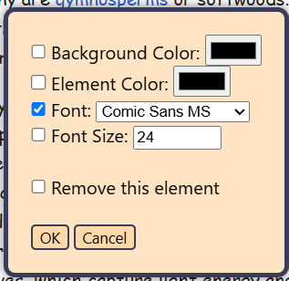
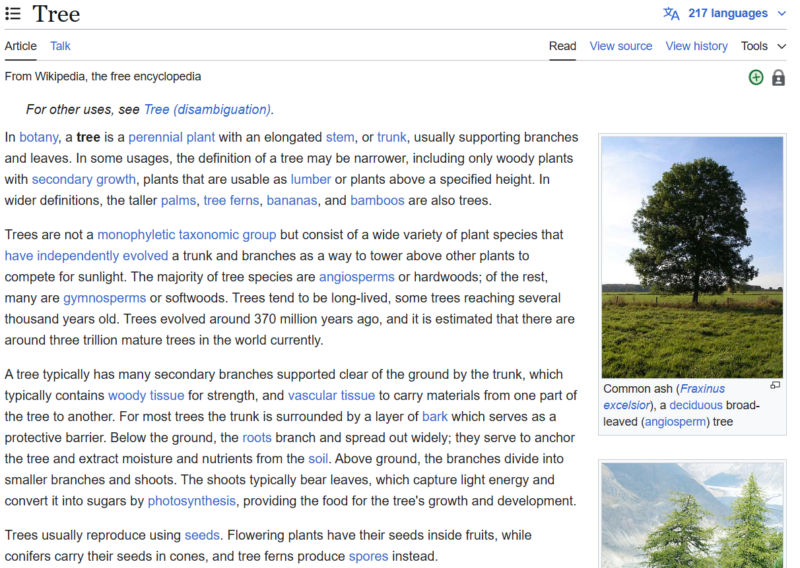
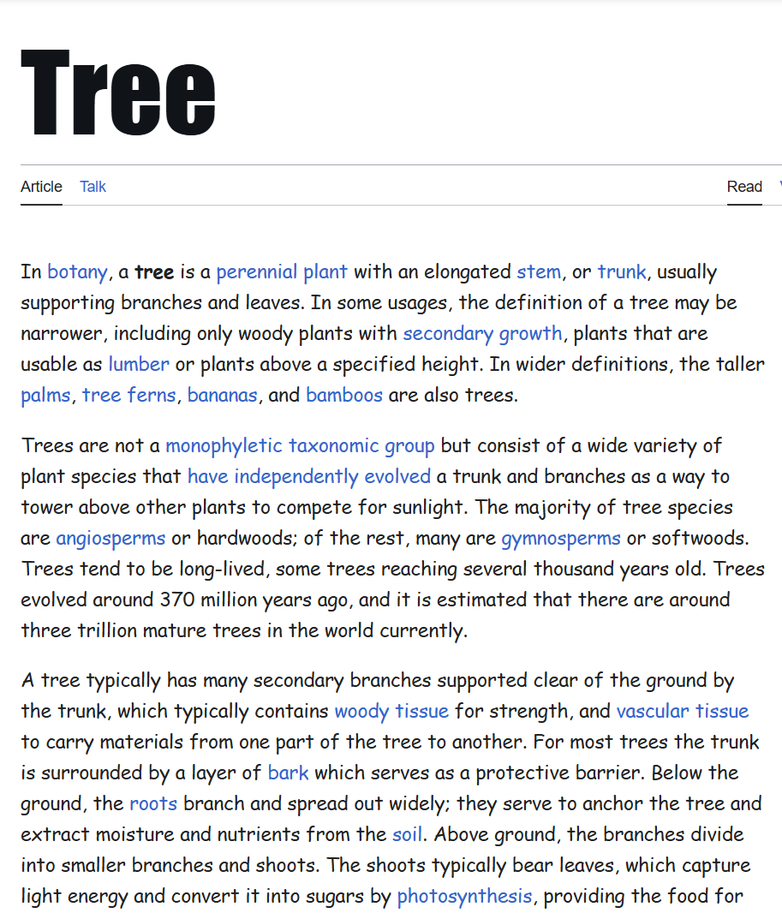
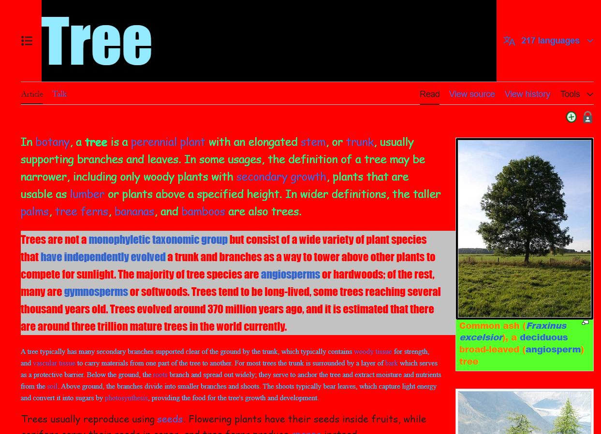

# StyleWizard
---

###### **Tired of seeing boring / ugly websites?**
###### StyleWizard is a browser extension adding the feature to quickly change a website's style
---

## Usage:
- Get the extension [coming soon](here) [Coming Soon]
- Or download the zip in `Releases` and load it by yourself
- Activate it
- Right click on any website (open context menu)
- Click ``Activate Styling``
- Hold ``ctrl`` (Windows / Linux) or ``cmd`` (MacOS) and click the element you want to modify
- Change the values and tick what should be kept
- Click ``OK`` or ``Cancel``

## Features:
- Easy to accsess via a key combination
- Change:
    - Background color
    - Element color / Font color
    - Font family
    - Font size
- Remove an element
- If you need help, click the extensions icon on the top right and click the StyleWizard icon

## Example screenshots:

-**Instead of:**

-**Why not:**

-**Or even:**

(Images from wikipedia)

## Privacy Notice:
StyleWizard does not collect, store, or transmit any personal data, browsing history, or user behavior. No data is sent to external servers. The extension operates entirely on your local browser and only modifies the appearance of websites as per user input. All changes made using StyleWizard are purely visual and temporary. These modifications are similar to what can be achieved manually using the built-in DevTools. This extension provides a more user-friendly way to change the style. See [Privacy Policy](privacy.md).

## Disclaimer & Liability:
This software is provided "as is", without any warranties or guarantees. The developers are not responsible for any issues, damages, or unexpected behavior caused by the use of this extension.

While StyleWizard only modifies website styles in a way that is possible via browser Developer Tools, you use this extension at your own risk.

By downloading and using this extension, you agree that the developer is not liable for any damages, data loss, or other consequences resulting from its use. See the [LICENSE](License.txt) file.

## License:
- See the [LICENSE](License.txt) file.

## Credits:
- Code: Qwatrum
- Extension icon was made with AI

#### Made by Qwatrum